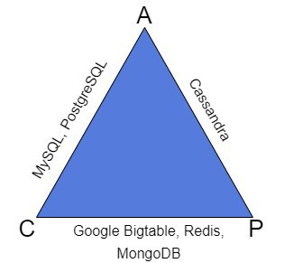

# Definitions

CAP is an abbreviation of Consistency, Availability, and Partition tolerance. Let’s discuss these three concepts in simple words:

1. Consistency means that every read operation will result in getting the latest record. All the information is guaranteed to be up to date.
2. Availability is a property that indicates a distributed system will always be available. One or more nodes of such a system might turn off; however, the system will still be accessible through other nodes.
3. Partition tolerance represents the ability of the system to be partitioned. Thus it means that every node can work independently from the other ones.

# Theorem

The CAP Theorem states that a distributed system can only meet 2 of 3 properties. So there might only be CA, AP, or CP systems. 

We can’t guarantee the third property will be achieved while the other two properties are already guaranteed. Consequently, no CAP distributed systems exist. We’ll have a look at the examples of different types of systems in the next section.

# Databases and CAP
  
Let’s introduce an important definition to more easily understand the differences in the databases.

## Replication

Replication is one of the database scaling techniques. This technique is based on the idea that data from one database server can be copied continuously (replicated) to one or more other servers (called replicas). It becomes possible for an application to use more than one server to process all requests. Therefore, it becomes possible to distribute the load from one server to several.

Usually, the main node is called the master. All the replicas are called the slaves. The master may support only write operations to make changes in the database. After that, the changes are distributed to all slaves’ replicas for a read operation. This helps to keep the consistency of the database. Such replication is called master-slave replication.

However, master-master replication also exists, where the master and all the replicas are allowed to perform both read and write operations.

## Databases Comparison

Let’s look at a triangle, where some of the most common databases are classified according to their types:

As we can see, the different types of databases are strictly classified as CA, AP, or CP systems.

1. CA systems guarantee consistency and availability. Most relational databases are examples of CA systems. For instance, in PostgreSQL, the consistency is reached with the master-slave replication, and the two-phase transaction commit approach. The synchronization of replicas with the master is either synchronous or asynchronous, and the system is strongly available. The problem starts when partitioning. We’ll never guarantee consistency if we try to use partitioning in PostgreSQL.

2. AP systems are about availability and partition tolerance. Consequently, they might not be consistent all the time. An example of an AP system is the NoSQL database is Cassandra. It uses master-master replication, which in fact conforms to the AP system definition. We can easily perform partitioning to Cassandra. All nodes will be independent units. Thus, the system will be available if at least one of the nodes work. However, the synchronization between partitioned nodes may lead to poor consistency.

3. CP systems are consistent and partition tolerant. For example, MongoDB is a NoSQL database and a CP system. Strong consistency is reached by using the single master node for the write operation. MongoDB can be partitioned without losing consistency. However, when partitioning, it may become unavailable. The system won’t accept write requests until it makes sure that all operations will be saved safely.

# Example of a Simple Distributed System Design

In this section, we’ll try to design our own distributed system. Let’s start with a single node. Let’s suppose we work in a call center that provides a logging service. We receive calls from customers who need to register some activities (write operation). They’ll also be able to call back to ask to remember the things they told us before (read operation). We decide to write all the information in a single notebook.

Everything works fine, but the number of customers starts growing every day. We have to put the calls in a large queue, but we understand we lose the customers who can’t wait for hours until we answer their call.

We decide to invite a friend to join our logging service. He will also answer the phone, and write and read requests from his own notebook. Notice that now we have two different notebooks. Everything goes much better for a while until a problem arises.

## AP System
We received a call from a customer who asked us to write down his wife’s birthday. After some months he called back because he knew his wife’s birthday was coming up, but he couldn’t remember the date. This time our friend answered the call. He didn’t have the information about the birthday in his notebook because we didn’t share it. The customer got mad:

[AP 1](https://www.baeldung.com/wp-content/uploads/sites/4/2021/03/AP-1.jpg)

In the above image, the phone represents the customer. The LS1 and LS2 are the two nodes of a logging service, us and our friend.

The above situation is called inconsistency. For now, our system is an AP system because it is available and partition tolerant.

## CP System
Now we’ve decided to deal with the inconsistency. After each call from a customer to either us or our friend, we write everything in our notebooks and then call each other to synchronize the information. So now the customers will always get the true information from the service.

There also might be a situation when we get sick and can’t work for a day or more. In such cases, our friend first checks if he can call us to synchronize our notebooks. If we are unavailable, then he emails us. When we get back to work, we’ll first check the email to fill the missing data in our notebook:

[CP 1](https://www.baeldung.com/wp-content/uploads/sites/4/2021/03/CP-1.jpg)

As a result, the customers will have to wait for an answer from the service. We’ll have to spend time calling each other or writing down the information from the email to refresh our notebooks. The service becomes a bit unavailable. This is a CP system now.

## CA System
Now our friend decides to quit, but the logging service continues to work. We have just one phone and one notebook, just like at the very beginning. As we may notice, the system is still available. We’ll continue answering the calls and logging them into our notebook:

[CA](https://www.baeldung.com/wp-content/uploads/sites/4/2021/03/CA.jpg)

Thus, our system is consistent. The consistency is reached by having a single source, one notebook. We don’t need to synchronize with our friend’s notebook anymore. However, the system is not partitioned because we are the single node in our logging service. This is a CA system. If we take on another friend for the job due to a large number of customers, then we’ll have to choose between either availability or consistency again.

## Results
The conclusion from this example is that we’ll always have to choose between system properties. No perfect systems exist. We should always build a system depending on the requirements, types, and frequency of operations in it. The idea is to find a balance of C, A, and P.

# CAP Problems
Nowadays, CAP Theorem isn’t strictly used. It has some major misunderstandings and ambiguous definitions, which are far from real-world applications.

Availability in CAP has two problems. One of them is that there is no definition of partly available systems. For instance, the system might be available at 50% because half of its nodes turned off due to some problems. The system is still available for customers; however, it is not available in CAP.

The second problem is that the availability in CAP doesn’t cover the response time (latency). It means that the system which answers 1 hour or 1 day after a read request is available.

Many systems might just be 'P' systems. Imagine the system with the master-slave replication technique. Suppose such a system contains one master node, one slave, and a customer. The customer can read from the slave and write only to the master node. If we immediately lost the connection to the master, then the customer loses availability. Our system becomes CP.

Imagine another situation. The customer performs a write operation to the master. Then it tries to read from the slave and gets incorrect data. This may happen because the system didn’t have enough time for synchronization. We’ve lost the consistency. Now our system is just P if it is possible.

## PACELC
PACELC Theorem is an extension and an alternative to CAP Theorem. The rules of PACELC are better suited to real-world distributed systems. The theorem is a kind of formula: “If the system is P then it is A or C, else it is C or L.”

In simple words, if the system can be partition tolerant, then we have to choose between its availability or consistency. If the system cannot be partitioned to work normally, then we choose between either building a consistent system, or a system with low latency (average response time).

